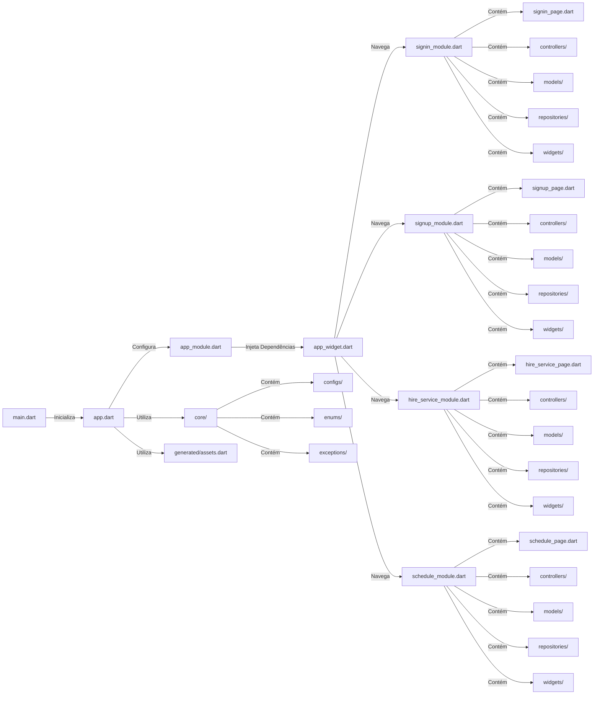

# Poços Artesianos - Frontend Mobile

Este repositório contém o código-fonte do frontend mobile do projeto Poços Artesianos, desenvolvido em Flutter. O aplicativo facilita a contratação e agendamento de serviços de poços artesianos para os clientes.

## Visão Geral

O aplicativo Poços Artesianos é uma solução prática e rápida para a solicitação e agendamento de serviços de poços artesianos. Ele se integra com microserviços backend para gerenciar clientes, serviços, autenticação e notificações.

## Funcionalidades Principais

- Navegação e busca por serviços disponíveis
- Contratação de serviços de poços artesianos
- Visualização de disponibilidade e agendamento de serviços
- Recebimento de notificações sobre status de serviços e agendamentos

## Arquitetura do Sistema

A arquitetura do aplicativo móvel Poços Artesianos segue os princípios da Clean Architecture, utilizando uma estrutura modular para facilitar a manutenção, escalabilidade e testes. A aplicação é desenvolvida em Flutter, utilizando MobX para gerenciamento de estado, flutter_modular para injeção de dependências, Dio para requisições HTTP, firebase_messaging para notificações e flavors para gerenciamento de ambientes.

### Componentes do Sistema

#### Componentes Principais

- **App:** Contém a configuração principal do aplicativo, incluindo a inicialização e a configuração dos módulos.
- **Core:** Contém configurações, enums, exceções e outras funcionalidades centrais que são compartilhadas entre os módulos.
- **Modules:** Contém os módulos específicos do aplicativo, cada um encapsulando uma funcionalidade específica como autenticação, contratação de serviços, agendamentos, etc.

#### Componentes Secundários

- **Generated:** Contém arquivos gerados automaticamente, como a classe de ativos.
- **Main:** Ponto de entrada do aplicativo.

### Estrutura de Diretórios

```
artesian-well/
├── lib/
│   ├── app/
│   │   ├── app.dart
│   │   ├── app_module.dart
│   │   ├── app_widget.dart
│   ├── core/
│   │   ├── configs/
│   │   │   ├── api/
│   │   │   │   ├── baseapi_repository.dart
│   │   │   │   ├── networkapi_repository.dart
│   │   ├── enums/
│   │   ├── exceptions/
│   │   └── ...
│   ├── generated/
│   │   └── assets.dart
│   ├── modules/
│   │   ├── signin/
│   │   │   ├── controllers/
│   │   │   ├── models/
│   │   │   ├── repositories/
│   │   │   ├── widgets/
│   │   │   ├── signin_page.dart
│   │   │   ├── signin_module.dart
│   │   ├── signup/
│   │   │   ├── controllers/
│   │   │   ├── models/
│   │   │   ├── repositories/
│   │   │   ├── widgets/
│   │   │   ├── signup_page.dart
│   │   │   ├── signup_module.dart
│   │   ├── hire_service/
│   │   │   ├── controllers/
│   │   │   ├── models/
│   │   │   ├── repositories/
│   │   │   ├── widgets/
│   │   │   ├── hire_service_page.dart
│   │   │   ├── hire_service_module.dart
│   │   ├── schedule/
│   │   │   ├── controllers/
│   │   │   ├── models/
│   │   │   ├── repositories/
│   │   │   ├── widgets/
│   │   │   ├── schedule_page.dart
│   │   │   ├── schedule_module.dart
│   │   └── ...
│   ├── main.dart
├── test/
└── pubspec.yaml
```

### Diagrama de Arquitetura



### Descrição dos Componentes

#### App

- **app.dart:** Arquivo principal que inicializa o aplicativo.
- **app_module.dart:** Configura e injeta as dependências do aplicativo utilizando flutter_modular.
- **app_widget.dart:** Define o widget principal do aplicativo e configura a navegação entre módulos.

#### Core

- **configs/:** Contém configurações globais do aplicativo.
- **configs/api/:** Contém configurações de conexão com API (Dio) para o APP.
- **enums/:** Define enums utilizados em todo o aplicativo.
- **exceptions/:** Define exceções customizadas para o aplicativo.
- **...:** Outros utilitários e classes compartilhadas.

#### Modules

Cada módulo encapsula uma funcionalidade específica do aplicativo e segue a estrutura abaixo:

- **controllers/:** Contém os controladores do módulo, responsáveis pela lógica de negócios e gerenciamento de estado.
- **models/:** Define os modelos de dados utilizados no módulo.
- **repositories/:** Implementa a lógica de acesso a dados e comunicação com APIs.
- **widgets/:** Contém widgets específicos do módulo.
- **signin_page.dart:** Define a página principal do módulo de autenticação (signin).
- **signin_module.dart:** Configura e injeta as dependências do módulo de autenticação (signin).
- **signup_page.dart:** Define a página principal do módulo de registro (signup).
- **signup_module.dart:** Configura e injeta as dependências do módulo de registro (signup).
- **hire_service_page.dart:** Define a página principal do módulo de contratação de serviços.
- **hire_service_module.dart:** Configura e injeta as dependências do módulo de contratação de serviços.
- **schedule_page.dart:** Define a página principal do módulo de agendamento.
- **schedule_module.dart:** Configura e injeta as dependências do módulo de agendamento.

#### Generated

- **assets.dart:** Arquivo gerado automaticamente que mapeia os recursos de ativos do aplicativo.

#### Main

- **main.dart:** Ponto de entrada do aplicativo, responsável por chamar `app.dart` para inicialização.

## Requisitos

- Flutter SDK
- Android Studio ou Visual Studio Code
- Emulador Android ou dispositivo físico para testes

## Configuração do Ambiente

1. Clone este repositório:
   ```bash
   git clone https://github.com/seu-usuario/pocos-artesianos-frontend.git
   ```

2. Acesse o diretório do projeto:
   ```bash
   cd pocos-artesianos-frontend
   ```

3. Instale as dependências:
   ```bash
   flutter pub get
   ```

4. Execute o aplicativo:
   ```bash
   flutter run
   ```

## Contribuição

Contribuições são bem-vindas! Se você encontrar algum problema ou tiver sugestões de melhorias, por favor, abra uma issue ou envie um pull request.

Antes de contribuir, certifique-se de ler as diretrizes de contribuição do projeto.

## Licença

Este projeto está licenciado sob a [MIT License](LICENSE).

## Contato

Se você tiver alguma dúvida ou precisar de mais informações, entre em contato com a equipe de desenvolvimento:

- Nome do Responsável
- Email: contato@pocos-artesianos.com
- Website: [www.pocos-artesianos.com](https://www.pocos-artesianos.com)

---

Esperamos que este README forneça uma visão geral clara do projeto Poços Artesianos - Frontend Mobile e ajude os desenvolvedores a começar a trabalhar no projeto. Sinta-se à vontade para personalizar e expandir este README de acordo com as necessidades específicas do seu projeto.
